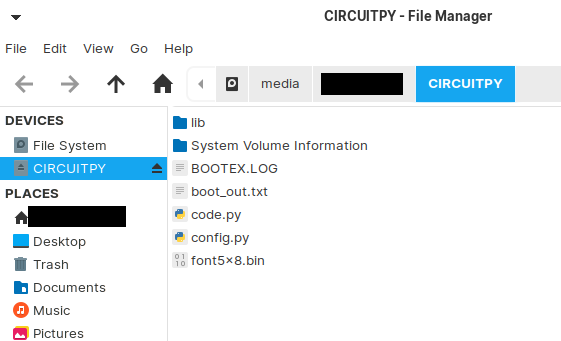

# Pico Macro Key
登録しておいた文字列をワンボタンで呼び出すマクロキーボードです。  
以下の特徴があります。  
- PCなどにUSB接続して利用します。
- 複数の文字列を登録して呼び出せます。（上限はRaspberryPicoの容量上限です）
- キーボードのタイピングとして入力されます。（文字列がそのまま送信されるわけではありません）
- USキーボードとJPキーボードの入力に対応しています。
- 起動時のPinの入力を設定できます。途中でロックもできます。

# 実装
## 用意するもの
- Raspberry Pi Pico
- シフトキー用ボタンスイッチ
- ボタンスイッチx3
- 3Vで動作するブザー（なくても可）
- LCD 128x32 I2C接続のもの

※ シフトキーと通常ボタンは形か色を変えるとわかりやすいです。

## Raspberry Pi Picoのセットアップ
1. Circuit Pythonをインストールしてください。  
https://circuitpython.org/board/raspberry_pi_pico/
2. [src](src) 以下のファイルをRaspberry Pi Picoのフォルダにコピーする  

3. 以上です

## 電子回路を配線する
※ もしGP接続を変更する場合は、code.pyを開いて"# Circuit Configlation"の下に設定があるので変更してください。  ｀

  
ボタンの配線  

|  名称  |  配線１  |  配線２  |
| ---- | ---- | ---- |
|  シフトキーボタン  |  GP13  |  3.3V  |
|  ボタン１  |  GP10  |  3.3V  |
|  ボタン２  |  GP7  |  3.3V  |
|  ボタン３  |  GP4  |  3.3V  |

ブザーの配線  

|  名称  |  プラス接続  |  マイナス接続  |
| ---- | ---- | ---- |
|  ブザー  |  GP16  |  GND  |

LCDディスプレイの接続

|  名称  |  3.3V  |  GND  |  SCL  |  SDA  |
| ---- | ---- | ---- | ---- | ---- |
|  LCD 128x32  |  3.3V  |  GND  |  GP21  |  GP20  |

## コンフィグの設定
Raspberry Pi Picoにコピーした config.py を編集して保存してください。

|  設定  |  概要  |  値  |
| ---- | ---- | ---- |
|  uselock  |  起動時やロック時にPin要求するかを設定します  |  True:利用する False:利用しない（スキップ）  |
|  lockpin  |  ロック解除のPinを配列で設定します  |  1:ボタン１ 2:ボタン２ 3:ボタン３  |
|  buzzer  |  ブザー音の有効無効を設定します  |  True:音を鳴らす False:サイレントにする  |
| layoutType  |  USキーボード入力かJPキーボード入力かを指定します  |  "en" または "jp"  |
| keymap  |  マクロ設定をします  |  以下参照  |
| keymap > enabled |  このセクションを利用するか（有効にするか）を指定します  |  True:有効 False:無効  |
| keymap > data |  マクロ文字列、画面に表示するマクロ名を設定します。必ず中の配列は３つで設定してください。  |  以下参照  |
| keymap > data > label |  LCD画面に表示される名称です  |  半角英数字  |
| keymap > data > value |  ボタンを押したときに入力される文字列です  |  半角英数字（タブ等も可能）  |

## 動作確認
1. PC等とRaspberry Pi PicoをUSB接続します
2. 「Locked. Enter Pin and Shift.」を表示されたら、Pinを入力します。最後にShiftを押して確定します。
3. 成功すると「You got it. Welcome to customkey. (^ ^)b」を表示されます。
4. 画面に、利用可能なマクロが表示されます。
5. ボタンを押下すると、設定したコマンドがPCに入力されます。
6. Shiftを押下すると、次のマクロ３つに切り替わります。
7. Shiftを押下したままボタン１を押下するともう一度２のロックモードに戻ります。

# 免責事項
MITライセンスです。  
改変、公開は自由です。  
ご自身の責任においてご利用ください。  
これによって発生した損害はこちらでは負いかねます。  
特に、情報漏えいになるような内容をマクロに登録されないようご注意ください。
