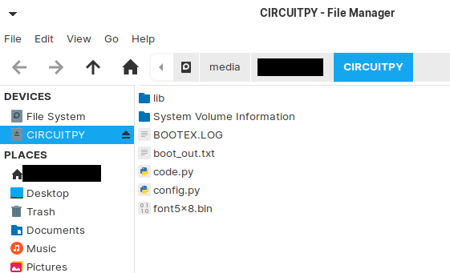
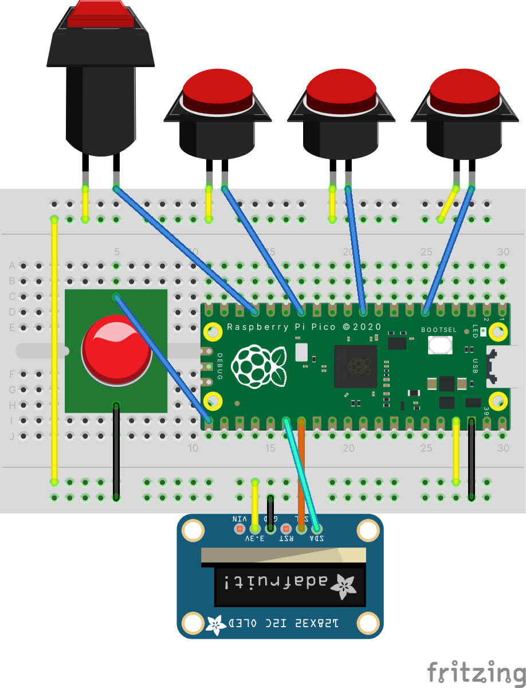

日本語話者のかたには [README.jp.md](/README.jp.md) を用意してあります。  
If you are Japanese speaker, we have [README.jp.md](/README.jp.md) for you.

# Pico Macro Key
Macro Keyboard with Raspberry Pi Pico  
Spec
- Connect with PC through USB interface
- Register multiple macro
- Command is sent as keyboard typing. Not as text.
- Configurable keyboard type US layout or JP layout
- Configurable Pin no. for screen lock.

# Implementation
## Prepare
- Raspberry Pi Pico
- Button Switch for Shift Key
- Button Switch
- 3V Buzzer (optional)
- LCD Display 128x32 I2C Mono

## Set up Raspberry Pi Pico
1. Install Circuit Python
https://circuitpython.org/board/raspberry_pi_pico/
2. [src](src) Copy source code to root directory of Raspberry Pi Pico 

3. Thats all

## Electric Circuit
※ If you wanna change the GP Pin, please change the pin no "# Circuit Configlation" section in code.py  ｀

  
Buttons  

|  Component  |  term1  |  term2  |
| ---- | ---- | ---- |
|  Shift Button  |  GP13  |  3.3V  |
|  Button1  |  GP10  |  3.3V  |
|  Button2  |  GP7  |  3.3V  |
|  Button3  |  GP4  |  3.3V  |

Buzzer

|  Component  |  positive  |  negative  |
| ---- | ---- | ---- |
|  Buzzer  |  GP16  |  GND  |

LCD Display

|  Component  |  3.3V  |  GND  |  SCL  |  SDA  |
| ---- | ---- | ---- | ---- | ---- |
|  LCD 128x32 Mono |  3.3V  |  GND  |  GP21  |  GP20  |

## Configration
Plese edit "config.py" in Raspberry Pi Pico root directory.

|  Setting Name  |  Exp  |  Value  |
| ---- | ---- | ---- |
|  uselock  |  Use Lock Screen when waking up and locking  |  True or False  |
|  lockpin  |  Lock pin no. as Array  |  1:Button1 2:Button2 3:Button3  |
|  buzzer  |  Enable buzzer  |  True / False  |
| layoutType  |  Designating keyboard layout  |  "en" or "jp"  |
| keymap  |  Macro setting  |  (see below)  |
| keymap > enabled |  Enable section  |  True or False  |
| keymap > data |  Macro setting for each button. It should contain 3 item in Array  |  (see below)  |
| keymap > data > label |  Label for display in LCD  |  1byte Numeric / Alphabet / Simbol  |
| keymap > data > value |  Command when button is pressed down  |  1byte Numeric / Alphabet / Simbol / Tab  |

## Test behaviour
1. Connect Raspberry Pi Pico and PC with USB
2. 「Locked. Enter Pin and Shift.」will be shown. Put pin no. to push shift at the end.
3. 「You got it. Welcome to customkey. (^ ^)b」will be displayed when it succeeded.
4. Then first 3 macro will be shown in LCD.
5. Command will be sent to PC when button pressed.
6. Push Shift key to move the next 3 macro.
7. Press Shift Key + Button1 to go to Lock Mode.

# Disclaimer
MIT License. 
Please use this on your responsibility.
Thanks.
